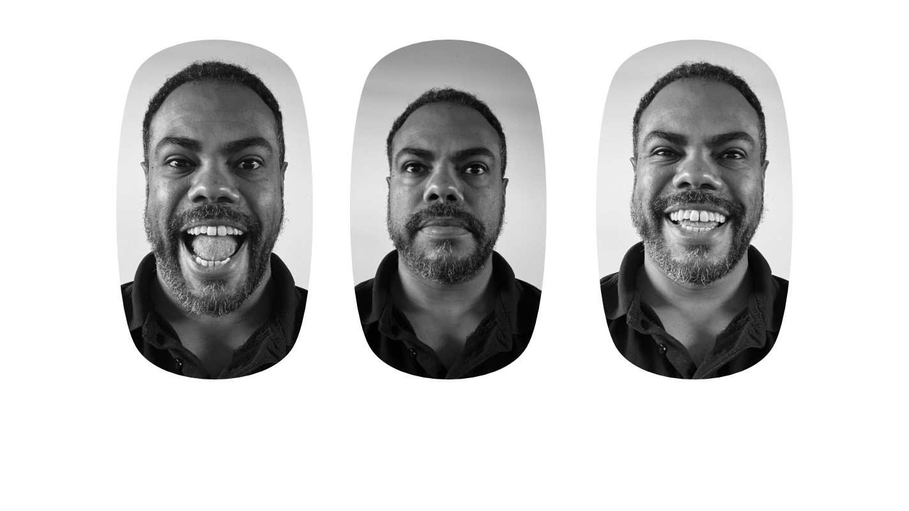

# 👤 Sobre Mim (About Me)


A personal portfolio webpage built with pure HTML and CSS as part of the Triple 10 bootcamp - Sprint 1. This project showcases fundamental web development skills including semantic HTML, custom styling, flexbox layouts, and custom font integration.

---

## 📸 Screenshots

> Add your screenshots here to showcase your project!

<!-- Example:


-->

---

## 🚀 Technologies Used

- **HTML5**: Semantic markup structure
- **CSS3**: Custom styling and layouts
- **Flexbox**: Responsive layout system
- **Custom Fonts**: 
  - Permanent Marker (for headings)
  - Inter (for body text)
- **@font-face**: Custom font loading

---

## ✨ Features

- ✅ **Hero Section**: Eye-catching banner with overlay and large title
- ✅ **Card Layout**: Flexible card-based content display
- ✅ **Custom Typography**: Integration of custom web fonts (Permanent Marker & Inter)
- ✅ **CSS Box Shadow**: Modern card styling with shadow effects
- ✅ **Flexbox Layout**: Responsive and flexible content arrangement
- ✅ **Semantic HTML**: Proper use of header, section, and footer elements
- ✅ **Clean CSS Reset**: Consistent styling across browsers

---

## 📁 Project Structure

```
sobre-mim/
│
├── index.html          # Main HTML file
├── style.css           # Stylesheet with all CSS rules
├── README.md           # Project documentation
│
├── fonts/              # Custom font files
│   ├── Inter.ttf
│   ├── PermanentMarker.ttf
│   └── PermanentMarker.woff
│
└── images/             # Image assets
    ├── banner.png
    ├── banner_v1.png
    ├── banner_v2.png
    └── vic_*.png       # Profile images
```

---

## 🛠️ Installation & Usage

### Prerequisites
- A modern web browser (Chrome, Firefox, Safari, Edge)
- No additional dependencies required!

### Steps to Run Locally

1. **Clone the repository**
   ```bash
   git clone <your-repository-url>
   ```

2. **Navigate to the project directory**
   ```bash
   cd sobre-mim
   ```

3. **Open in browser**
   ```bash
   # Option 1: Double-click index.html
   # Option 2: Use a local server (recommended)
   
   # If you have Python installed:
   python -m http.server 8000
   
   # If you have Node.js installed:
   npx http-server
   ```

4. **View in browser**
   - Open `http://localhost:8000` (if using a server)
   - Or simply open `index.html` directly in your browser

---

## 📚 Learning Outcomes

This project helped me practice and learn:

- ✏️ **HTML5 Semantic Elements**: Proper use of `<header>`, `<section>`, `<footer>`
- 🎨 **CSS Fundamentals**: Selectors, properties, and values
- 📦 **Box Model**: Understanding margin, padding, and box-sizing
- 🔲 **Flexbox**: Creating flexible and responsive layouts
- 🎭 **Custom Fonts**: Using `@font-face` to load custom typography
- 🖼️ **Background Images**: CSS background properties and positioning
- 🌈 **RGBA Colors**: Implementing semi-transparent overlays
- 💎 **Box Shadow**: Adding depth and visual interest to elements
- 📐 **CSS Reset**: Normalizing default browser styles

---

## 🎓 About This Project

This project was developed as part of **Sprint 1** of the [Triple 10 Bootcamp](https://tripleten.com/), focusing on **HTML and CSS fundamentals**.

### Sprint 1 Objectives:
- Master HTML structure and semantic elements
- Learn CSS styling fundamentals
- Understand layout techniques (Flexbox)
- Work with custom fonts and images
- Create a personal portfolio page

---

## 🔜 Future Improvements

- [ ] Add responsive design for mobile devices
- [ ] Implement CSS animations and transitions
- [ ] Complete card content with real information
- [ ] Add footer signature
- [ ] Optimize images for web performance
- [ ] Add smooth scroll behavior
- [ ] Implement CSS Grid alongside Flexbox

---

## 👨‍💻 Author

**Victor**

- GitHub: [@your-github-username](https://github.com/your-github-username)
- LinkedIn: [Your LinkedIn](https://linkedin.com/in/your-profile)
- Triple 10 Student - Sprint 1

---

## 📝 License

This project is open source and available for educational purposes.

---

## 🙏 Acknowledgments

- **Triple 10 Bootcamp** for the curriculum and guidance
- **Google Fonts** for typography inspiration
- Sprint 1 instructors and mentors

---

### 💡 Note for Reviewers

This is a learning project focused on HTML and CSS fundamentals. Feedback and suggestions are always welcome!

---

*Built with ❤️ as part of my web development journey*

